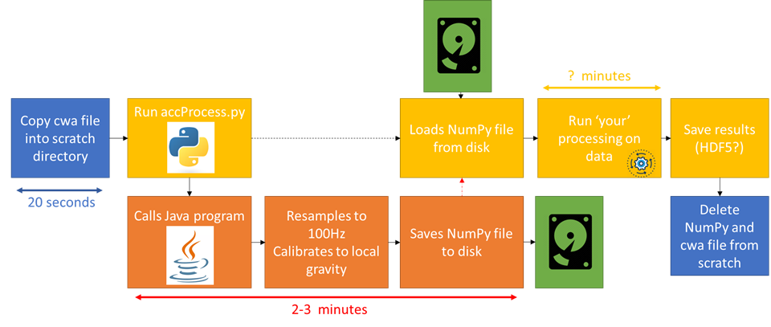

# BiobankActivityCSF
This repo contains code to process the accelerometer CWA files from the UK Biobank activity monitoring study in Python, and optionally on high performance computing infrastructure. This code is an adaption of [biobankAccelerometerAnalysis](https://github.com/activityMonitoring/biobankAccelerometerAnalysis) from Aiden Doherty/University of Oxford.

This code allows easy processing of the raw (but resampled by interpolation to account for sampling variation) accelerometer data in Python, sampled at 100 Hz, as apposed to operating on 5 s epochs.

This repo also contains scripts to allow this code to run on the [UoM CSF3](http://ri.itservices.manchester.ac.uk/csf3/). These scripts may also work on other high-performance computers that use SGE (which is used on many high-performance computing systems at multiple universities). However, note that some parts of this code are specific to the architecutre of the CSF and may need to be adapted to your specific system. This code can also be run on the [iCSF/incline](http://ri.itservices.manchester.ac.uk/icsf/) (the interative version of the CSF), but the batch scripts will not work on here, and this is recommended only for testing. 

Parts of this readme that directly relate to processing on the CSF3 will be highlighted by **CSF3 only** and can be ignored by those who only want basic processing in Python on their own computer rather than batch processing.

The pre-processing in this code is based off the [biobankAccelerometerAnalysis](https://github.com/activityMonitoring/biobankAccelerometerAnalysis) from Aiden Doherty/University of Oxford.

## What does this code do?
This code can be used for two purposes:
 
 - To resample the CWA files to a regular interval and then process them using your own processing in Python
 - To allow batch processing of the CWA files on high-performance computing to allow multiple files to be processed simultaneously, vastly increasing the throughput
 
The CWA files are not sampled at regular intervals nor are they calibrated to local gravity. To achieve this, this code uses the methods developed by the [UK Biobank Accelerometer expert group](https://github.com/activityMonitoring/biobankAccelerometerAnalysis), which are described [here](https://journals.plos.org/plosone/article?id=10.1371/journal.pone.0169649). The code here is designed to allow access to the full raw data, sampled at 100 Hz, rather processing on epochs as is down in most analysis (including the analysis by the Oxford group).

In order to acheive this, this code is run by calling a Python script, that in turn calls a complied Java programme that does the actual resampling and calibration of data. This java programme then saves the resampled data to the hard drive in NumPy format, which then when control is returned to the Python script is then reimported from the hard drive. This clearly generates substational overheads, but in testing this does not appear to significantly impact performance, as the actual resampling takes considerably longer than the saving and reloading data from disk. The graphic below demonstrates this pipeline, with approximate indicative times for each of the processing steps (note these refer to processing times on the CSF3, your times may vary).

**CSF3 only** Note that this method produces a large amount of temporary files, and therefore should only be run in the scratch storage on the CSF. 




## Getting Started
This script is designed to run on Linux using the [Anaconda distribution](https://www.anaconda.com/products/individual) of Python. For those using Windows, [WSL](https://docs.microsoft.com/en-us/windows/wsl/install-win10) is recommended. You will also need to have [Java 8](https://www.oracle.com/java/technologies/javase/javase-jdk8-downloads.html) installed (**CSF3 only** This is installed by default on the CSF3 and does not require a module file to be imported). All commands should be run from the terminal. 
If running this code at the University of Manchester, See Research IT guides on how to SSH to the [CSF3](http://ri.itservices.manchester.ac.uk/csf3/getting-started/connecting/) or [iCSF](http://ri.itservices.manchester.ac.uk/icsf/getting-started-on-icsf/connecting-to-incline/)

**CSF3 only** Log-on to the CSF or iCSF and enable the proxy to allow access to the internet

```
module load tools/env/proxy
```

Download this repository

```
git clone https://github.com/CASSON-LAB/BiobankActivityCSF.git
```

**CSF3 only** Request an interactive session so that we can run CPU intensive work (compling Java files)

```
qrsh -l short
```

Enter the repo and compile the Java code

```
cd BiobankActivityCSF
javac -cp java/JTransforms-3.1-with-dependencies.jar java/*.java
```

**CSF3 only** Exit the interactive session

```
exit
```

## Running the code
You should now be ready to run your processing of your own files.
The main file for the processing is accProcess.py, at line 279 the data is imported into two variables *data* and *time*. Where *data* is an array with 3 axes, corresponding the to x, y and z axes of the accelerometer data respectively. The array *time* contains the corresponding timestamps for each of the samples in *data*.
To run the file you 

As an example, lets try plotting a CWA file and saving it as a PDF within this script. An example CWA file has been included in this repo, called example.cwa.

First, we need to ammend accProcess.py to include the plotting commands and to save the data. Copy the following lines after the import command on line 279

```python
plt.plot(time, data)
plt.savefig('example.pdf')
```

**CSF3 only** To run your script you need to request an interactive session and import anaconda module. If using the iCSF there is no need to run the first line, code can be run direct.

```
qrsh -l short
module load apps/binapps/anaconda3/2019.03
```

Now it is time to run the script to test if it works. Ensure you are in the same directory as the script and run it. Note that depending on how Python has been installed, you may need replace `python` with `python3`

```
python accProcess.py example.cwa
```

After this finishes running you should be able to find a pdf file in your directory containing a plot of the waveform.
If this has worked you should now be ready to run your own code. To do this, delete the plotting commands and replace these with your own code or a call to your processing.


## Running on the CSF3
All commands in this section refer specifically to running the code in the batch enviroment on the UoM CSF3. As stated before, these commmands may be beneficial on other HPC systems.
**This code must be run on the scratch area on the CSF3 as it generates a large number of temporary files**
First copy this directory to the scratch storage and move into it

```
cd ..
cp -r BiobankActivityCSF/ scratch/
cd ~/scratch/BiobankActivityCSF/
```

# Basic batch script
The file biobankBasic.sh contains a script to process a single CWA file on the CSF. To run this, ensure your files are in the scratch directory, and it. If it was sucesssfully submitted then you should see a command saying that it has been submitted.

```
$ qsub biobankBasic.sh
Your job 1234567 ("biobankBasic.sh") has been submitted
```

There is more information on checking status of your jobs on the [CSF3 documentation](http://ri.itservices.manchester.ac.uk/csf3/getting-started/connecting/), but for now you can check on your job by running `qsub` and if nothing is returned it has either finished or failed. Once the job has finished, check the standard output and standard error files (those ending in .oXXXXXX and .eXXXXXX respectively (where XXXXXX is the job number assigned to your job).

# Higher throughput processing
To run the higher throughput script you first need a text file containing the file names of all the CWA files you want to process. This will depend on your unique application and the eids of the participants are randomised for each project. This file should be named to_process.txt
The script biobankBatch.sh creates an SGE job array allowing the processing of multiple files across multiple jobs in order to signficantly speed up processing.

This file will need modification to adapt it for the number of files you want to process.

Firstly, the range on line 3 describes how many separate jobs in the array to create. Ideally, you would make this number as large as possible (as the larger the more jobs that will run), but make it too high and jobs will just sit and wait in the queue. Previously I have found that 100 was optimum for me, but you may be able to increase this to 150 or decrease it if you have been submitting lots of work recently.
The parameter ‘FILES’ sets how many files to process in each job in each CSF job array. This is currently set to 10, but I set this to 700 in my final processing.

Multiplying ‘FILES’ and the number of jobs arrays together tells you how many records you will process, so in the version of biobankBatch.sh it will process 100 files (It will make 10 separate jobs each of which will process 10 files. Note that if the input file ‘to_process.txt’ contains more lines than this, only the first 100 lines in this file will actually be read.

For final processing you will want to make sure that the multiplication of JOBS and the number on line 3 is at least the same as the number of records you want to process. 


## Additional: Running this code in Anaconda Spyder
TODO: command line arguments

iCSF (module files to load)

An example data file called example.cwa can be downloaded from the manufacturer of the accelerometer at https://github.com/digitalinteraction/openmovement/wiki/AX3-GUI

